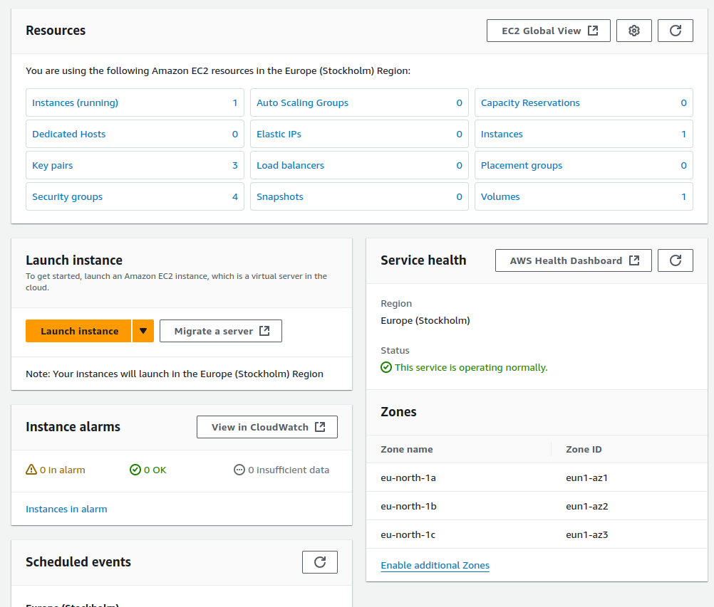
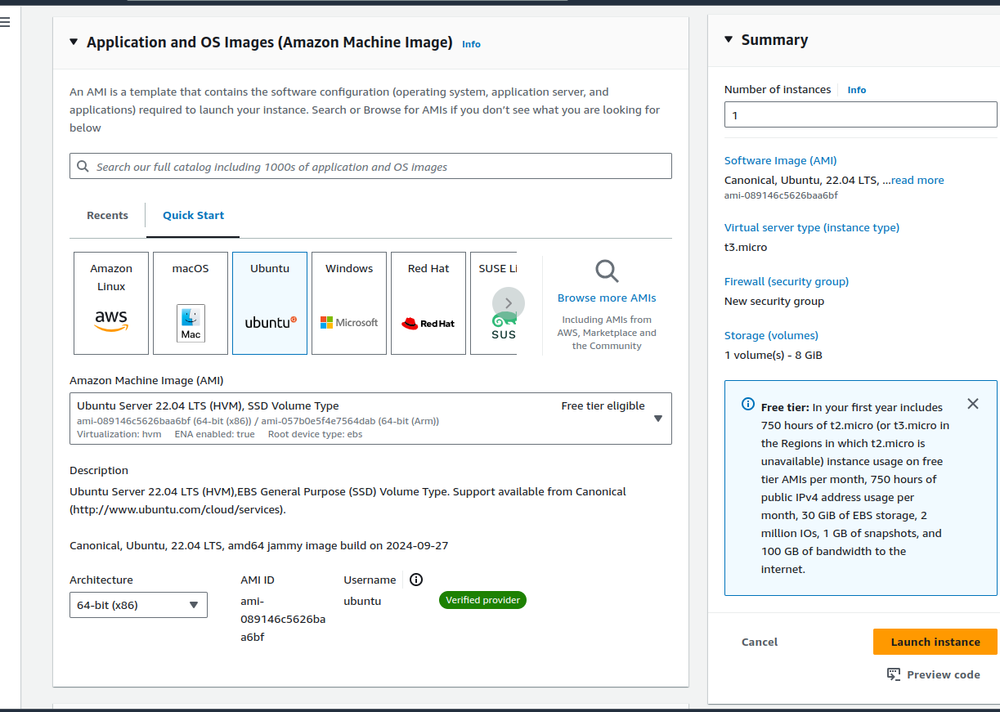
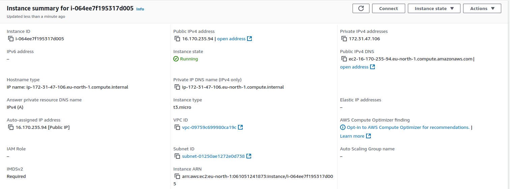
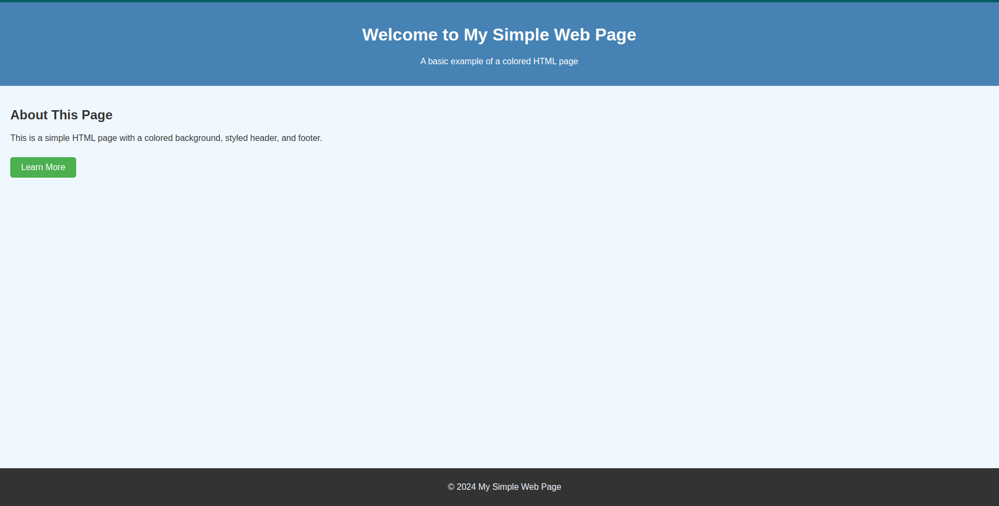

# AWS Server Setup

This document outlines the configuration and setup for the AWS EC2 server, providing instructions for access, user management, and monitoring.

- **AWS (Amazon Web Services)** is a comprehensive cloud computing platform that offers a variety of services, including storage, databases, networking, and computing power. AWS allows businesses and developers to create scalable applications without investing in physical hardware, as resources are managed and maintained by Amazon.

- **EC2 (Elastic Compute Cloud)** is a core AWS service that provides resizable virtual servers, known as instances, in the cloud. EC2 allows users to easily launch and configure servers with different operating systems and specifications. It is ideal for running applications, hosting websites, and testing software in a flexible, cost-efficient way, as users only pay for the resources they consume.

## Features

- **SSH Access**: Access to the server is controlled through SSH key authentication. Password authentication is disabled.
- **Firewall Configuration**: The UFW firewall is enabled, allowing access only to ports 21 and 22 (SSH) and 80 (HTTP).
- **Fail2ban**: Fail2ban is configured to block IP addresses after 5 failed login attempts within 15 minutes.
- **Apache2 Web Server**: Apache2 is running on port 80, providing a basic web server.

## Automated Scripts

- **automated_user.sh**: This script creates a new user, generates an SSH key pair, and configures SSH access for that user.
- **monitoring.sh**: This script runs every 15 minutes to monitor failed login attempts. If there are any failed attempts, it sends an email notification to the user.

## Prerequisites

Ensure that the following dependencies are installed on your local machine (for Linux users):

### First step:
```plaintext
Launch instance
```


### Second step:
```plaintext
Choose the Ubuntu 22.04
```
```plaintext
Then click on the Launch instance to start
```


### For Debian/Ubuntu:

```bash
    sudo apt update
    sudo apt install openssh-client
```
## Getting started

### Step 1: SSH Access

To access the AWS EC2 instance via SSH, use the following command:

```bash
    ssh username@publicIP -i /path/to/private_key.pem
```

- Replace **username** with your EC2 username.
- Replace **publicIP** with the public IP address of your EC2 instance.
- Replace **/path/to/private_key.pem** with the path to your private SSH key.

The public key should be placed in the **~/.ssh/authorized_keys** file on the server for access to be granted.

### Step 2: Access the Web Server and Apache2

- Install Apache

    Use the following command to install Apache:
```bash
    sudo apt install apache2 -y
```
- Adjust the Firewall (if needed)

    Apache typically runs on port 80 (HTTP) and port 443 (HTTPS). If you’re using UFW (Uncomplicated Firewall), you’ll need to allow traffic on these ports.
```bash
    # Allow HTTP traffic on port 80
    sudo ufw allow 'Apache'

    # If you're planning to use HTTPS, also allow traffic on port 443
    sudo ufw allow 'Apache Full'
```
- Start and Enable Apache

    Ensure Apache is running and set to start automatically on boot:
```bash
    # Start Apache
    sudo systemctl start apache2

    # Enable Apache to start on boot
    sudo systemctl enable apache2
```

- Test the Configuration

    Use the following command to check for syntax errors in the Apache configuration:
```bash
    sudo apache2ctl configtest
```
If the output is Syntax OK, then restart Apache:

```bash
    sudo systemctl restart apache2
```


To view the web server running on port 80, simply visit the public IP address of the EC2 instance in your browser:




```bash
    http://publicIP
```


### Monitoring and Alerts

The **monitoring.sh** script runs every 15 minutes and checks for failed login attempts. If any failed attempts are detected, an email will be sent to the designated user.

### Firewall and Ports

The UFW firewall is configured to allow traffic only on the following ports:

- SSH (Port 22): For SSH access.
- HTTP (Port 80): For web server access.

To view or modify firewall settings, use the following UFW commands:

- Check status:
```bash
    sudo ufw status
```

- Allow port 80 (if needed):
```bash
    sudo ufw allow 80/tcp
```

- Disable Firewall:
```bash
    sudo ufw disable
```


# Add User with SSH Key-Based Authentication Script

## Description
This script automates the process of adding a new Linux user, generating SSH keys, and setting up SSH key-based authentication. It’s designed to simplify the setup process for administrators who need to grant secure SSH access to multiple users quickly.

## Prerequisites
- **Root/Sudo Access**: This script requires superuser privileges to add users and configure SSH settings.
- **SSH Installed**: SSH must be installed on the system as the script uses `ssh-keygen` to create the SSH key pair.

## Usage

1. **Download and Save the Script**  
   Save the script as `add_user_with_ssh.sh`.

2. **Make the Script Executable**  
   Run the following command to make the script executable:
   ```bash
   chmod +x add_user_with_ssh.sh
   ```

3. **Run the Script with Sudo Privileges**
   Execute the script using sudo:
   ```bash
    sudo ./add_user_with_ssh.sh
    ```

4. **Follow Prompts**
You will be prompted to enter a username. The script will:

- Add the specified user to the system.
- Generate an SSH key pair for the user.
- Set up the .ssh directory and authorized_keys file.
- Enable SSH key-based authentication for the user.

## Script Overview
Here’s a breakdown of what each part of the script does:

- **Prompt for Username:** Requests the new username.
- **Create User:** Adds the new user account.
- **Generate SSH Key Pair:** Creates an SSH key pair in the user’s .ssh directory.
- **Create and Configure Authorized Keys:** Sets up the authorized_keys file and adds the public key, allowing secure SSH access.

**Simple Output** 
```bash
Enter your user name: johndoe
```


# Failed Login Alert Script

## Description
This script monitors failed login attempts on the system. When a failed login attempt is detected, the script sends an email alert to a specified recipient and logs the latest failed login attempts. It’s useful for administrators who want to be notified about suspicious login activities and track the recent failed login entries.

## Prerequisites
- **Mail Setup**: Ensure that `ssmtp` (or another compatible mail-sending program) is installed and configured to send emails.
- **Log Access**: This script requires read access to `/var/log/auth.log` to detect failed login attempts.

## Variables
- **`recipient`**: Email address to send the alert to.
- **`subject`**: Subject line of the alert email.
- **`message`**: Body content of the alert email.

## Usage

1. **Set up the Script**  
   Save the script as `failed_login_alert.sh`.

2. **Make the Script Executable**  
   Run the following command to make the script executable:
   ```bash
   chmod +x failed_login_alert.sh

3. **Configure the Script**
Update the recipient variable with the email address where you want to receive alerts. Optionally, adjust the subject and message variables as desired.

4. **Run the Script**

Execute the script manually or set it up as a cron job for periodic checks:

```bash
./monitoring.sh
```
To run as a cron job every 10 minutes, add this line to your crontab:
```bash
*/10 * * * * /path/to/failed_login_alert.sh
```

